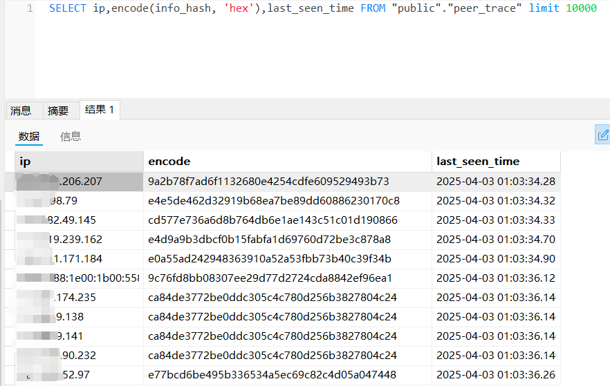
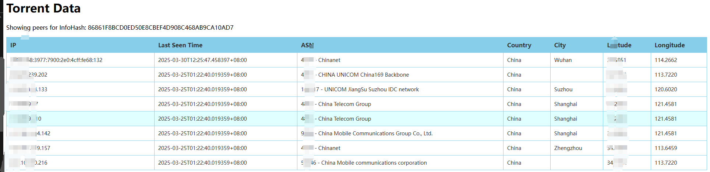
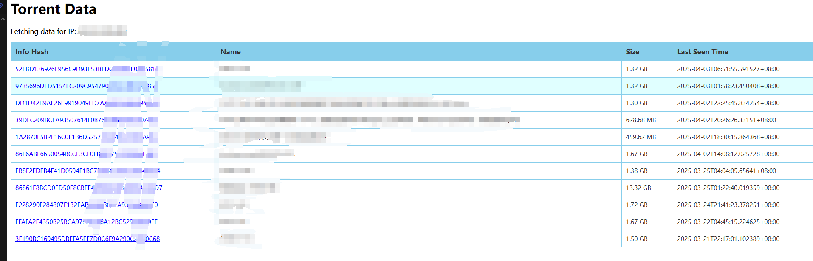

# bitmagnet-peertrace-CN

A self-hosted BitTorrent indexer, DHT crawler, content classifier and torrent search engine with web UI, GraphQL API and Servarr stack integration.

Visit the website at [bitmagnet.io](https://bitmagnet.io).

ADDED PEERTRACE function like https://iknowwhatyoudownload.com/, for 

To compile : `go build -ldflags "-X github.com/bitmagnet-io/bitmagnet/internal/version.GitTag=$(git describe --tags --always --dirty)"`
Geodb file download: https://github.com/P3TERX/GeoLite.mmdb, put it in internal/geodb/

For some reason, there will be quite a lot unrelated peertrace/torrent records in database after some run, to prune the db:

```
delete FROM peer_trace
WHERE info_hash IN (
    SELECT pt.info_hash
    FROM peer_trace pt
    LEFT JOIN torrents t ON pt.info_hash = t.info_hash
    WHERE t.info_hash IS NULL limit 5000000
);
```

and 

```
DELETE FROM torrents
WHERE info_hash IN (
    SELECT t.info_hash
    FROM torrents t
    LEFT JOIN peer_trace pt ON t.info_hash = pt.info_hash
    WHERE pt.info_hash IS NULL
);
```

## PeerTrace

data would be stored at table peer_trace



## index.py

https://80386.online/?infohash=infohash


https://80386.online/?ip=ipaddress



access index.py with no parameters will show records with the web client's ip address

https://80686.online/ is for ipv4 and ipv6 access, will show ipv6 address prioritarily

https://80386.online/ is for ipv4 access, will show ipv4 address only

